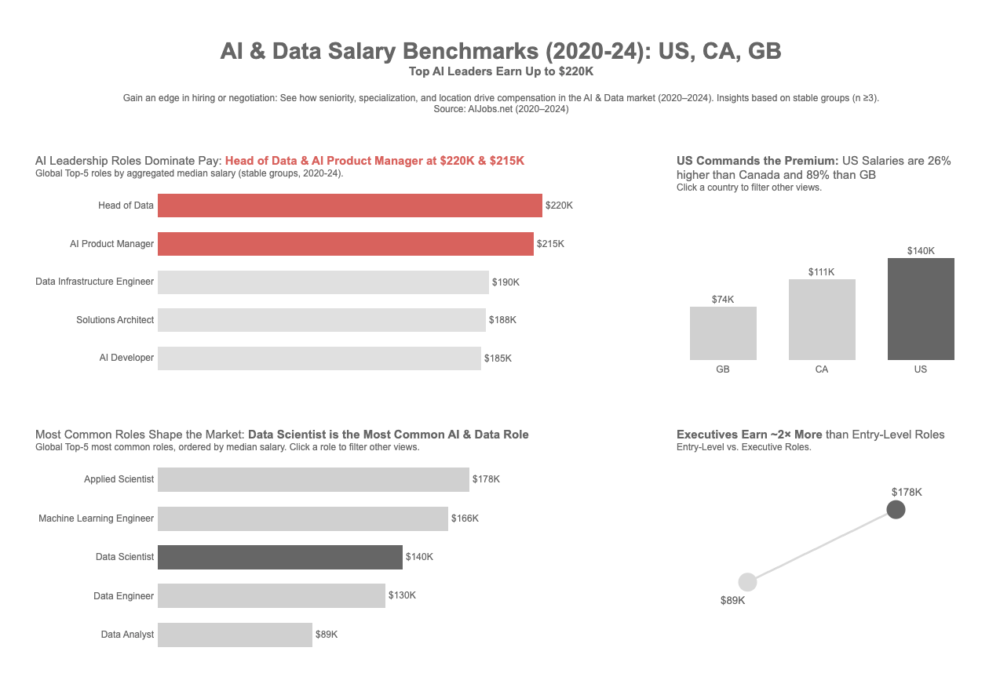

# **AI & Data Salary Benchmarks (2020–2024)**  
### **Top AI Leaders Earn Up to $220K — Insights Across US, Canada & Great Britain**



---

## **Overview**  
This project analyzes **AI & Data roles** across the **US, Canada, and Great Britain (2020–2024)** using aggregated median salaries.  
It combines **Python‑based analysis** and an **interactive Tableau dashboard** to provide actionable insights for recruiters, hiring managers, and professionals planning their careers.  

---

## **Quick Start**  
1. **Explore the Notebook**:  
   Click the button below to open and run the full analysis in Google Colab — no setup required.  

   [](https://colab.research.google.com/github/andrebjardim/ai-data-salary-benchmarks-2020-24/blob/main/notebooks/ai_data_salary_benchmarks_analysis.ipynb)  

2. **View the Dashboard**:  
   👉 [**Interactive Tableau Dashboard**](https://public.tableau.com/app/profile/andrejardim/viz/AIDataSalaryBenchmarks2020-24USCAGB/AIDataSalaryInsightsUSCAUK)  

---

## **Key Insights**  
- **Top‑Paid Roles:** *Head of Data* & *AI Product Managers* earn up to **$220K**.  
- **Geographic Premium:** US salaries are **26% higher than Canada** and **89% higher than Great Britain**.  
- **Seniority Gap:** Executives earn nearly **2× more than entry‑level roles**.  
- **Most Common Role:** *Data Scientist* remains the most in‑demand AI & Data position globally.  

---

## **Key Strategic Insights**
- **Seniority & specialization drive pay:** Executive roles and niche technical positions (e.g., *Head of Data*, *AI Product Manager*) command the highest salaries.  
- **Data roles dominate:** *Data Scientist*, *Software Engineer*, and *Data Engineer* are the most common in‑office positions.  
- **Company size matters:** Large companies pay higher median salaries, but medium‑sized firms make up most of the market.  
- **US leads compensation:** US roles pay substantially more than Canada and Great Britain at median.  
- **Stable groups improve reliability:** Analyses are based on market segments with ≥3 responses to ensure trustworthy insights.  

---

## **Recommendations**
- **For jobseekers:** Target executive and specialist roles for top compensation; use these benchmarks in salary negotiations.  
- **For employers:** Benchmark against US compensation for competitive global offers; focus on retention of senior and specialized talent.  
- **For analysts:** Use “stable group” medians for workforce planning and budgeting; avoid relying on single‑response outliers.  

---

## **Limitations & Next Steps**
- Data is filtered to **in‑office, full‑time roles** in **US, CA, GB** only.  
- Excludes **remote and hybrid positions**, which may pay differently.  
- Relies on **self‑reported salary data**, which may contain reporting bias.  
- Use of **stable groups (n ≥3)** improves reliability but excludes some niche or emerging roles with insufficient data.  

**Further analysis could include:**  
- Year‑over‑year salary trends  
- Remote vs. in‑office pay comparisons  
- Industry‑specific breakdowns  
- Expanded geographic coverage  

---

## **Project Structure**
```
ai-data-salary-benchmarks-2020-24/
│
├── data/
│    └── salaries.csv                  # Dataset used in the analysis
│
├── notebooks/
│    └── ai_data_salary_benchmarks_analysis.ipynb  # Full analysis
│
├── images/
│    └── dashboard_overview.png        # Tableau dashboard screenshot
│
└── README.md
```
---

## **Tech Stack**  
- **Python:** Pandas, Seaborn, Matplotlib  
- **Visualization:** Tableau Public  
- **Environment:** Jupyter Notebook / Google Colab  

---

## **Author**  
**André Jardim** — [LinkedIn](https://www.linkedin.com/in/andrebjardim/)  
